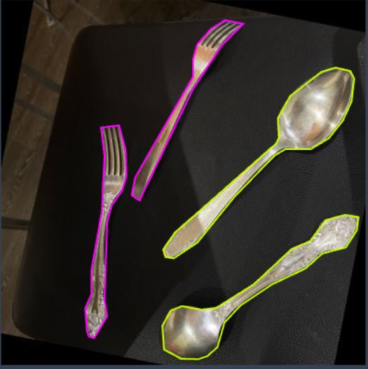

# Applied Machine Learning Assignment 2

## Task description

Train the Mask RCNN and smallest YOLOv8 for instance segmentation. 
Then evaluating them. 

### Steps 

1. Take photos of your environment of two or more objects. (at least 100 instances between all objects) 

2. Annotate them on Roboflow for segmentation. 

3. Train a Mask RCNN model using detectron2

4. Train Yolov8  the smallest size for segmentation

5. Evaluate both models based on mAP and speed and size.

## Solution

### 1. Firstly I took 105 photo of ```spoons``` and ```forks``` using my smartphone camera.

Example of the photo: 


### 2. Using Roboflow I annotated them. 

Example of the photo: 



After I used Augmentation:

* Flip: Horizontal
* Rotation: Between -15° and +15°
* Blur: Up to 1px

Next step is dividing into ```train/val/test```. 
So, train includes 214 images (87%), val 21 images (8%)
and test 11 images (4%).

The last step is export dataset for the models:

* For Mask RCNN is COCO format with images size 416x416
* For YOLOv8 Nano is YOLOv8 format with images size 416x416

### Training process

To see whole project at Google Colab use this [link](https://drive.google.com/drive/folders/1kBPy9iUnuA6cLYlCHZf-zn0LDOw7hQOG?usp=sharing).

So, i trained the models using [Google Colab Notebook](https://colab.research.google.com/drive/1TZlThfOngggMYYDBSRwh4vDFoWSHiSNv?usp=sharing).
Please, use the link to check my work.

Here is the structure of my notebook:


* First part is training a Mask RCNN model (R50-FPN3x) using detectron2
* Second part is training a YOLOv8 Nano
* Last one is Evaluation of these models

##### You can find outputs of RCNN model in `/output` folder and `/runs` of YoloV8 model

*P.S I couldn't upload the trained RCNN model to github, so download it from my Google Colab, please, if you want to check :)*


### Evaluation process

You can find evaluation of these models in my colab notebook.
All the graphs also included in the notebook.

Example Mask RCNN (R50-FPN3x) on test image:


Example YOLOv8 Nano on test image:


### Mask RCNN (R50-FPN3x)

```
Number of iterations - 500
Time of execution -  0:03:25
mAP@50 - 0.955
Image size - 416x416
Train memory - 3.4 GB
```

### YoloV8 Nano
```
Number of epochs - 30
Time of execution - 0:04:35
mAP@50 - 0.963
Image size - 416x416
Train memory - 6.72 MB
```


**Conclusion about the models**: So, as we can see, the result of YoloV8 Nano and Mask RCNN (R50-FPN3x) are very similar both in terms of training time and mAP@50.
But the strong difference is that the smallest Yolo model take much less memory than the smallest Mask RCNN model.
 

